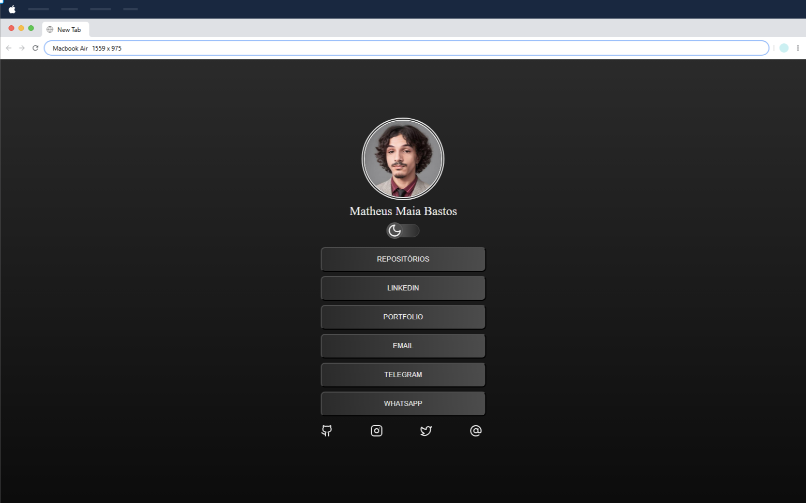
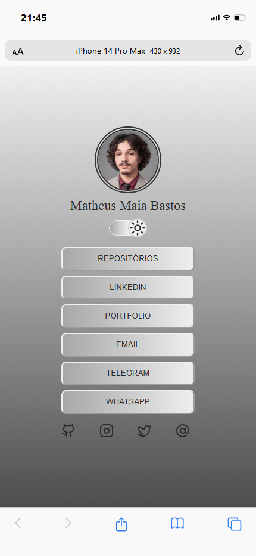

<h1 align="center">LinkTree</h1>

Reúna e compartilhe todos os seus links com praticidade.

<a href="#projeto">Projeto</a>&nbsp;&nbsp;&nbsp;|&nbsp;&nbsp;
<a href="#tecnologias">Tecnologias</a>&nbsp;&nbsp;&nbsp;|&nbsp;&nbsp;
<a href="#contato">Contato</a>

[Link para acesso](https://maiazip.github.io/LinkTree/)

<h2 align="center"> Preview Desktop </h2>

<h2 align="center">Preview Mobile </h2>

## Projeto
O projeto LinkTree foi feito para reunir diversos links em um único lugar, agregando as informações e assim facilitando o acesso a qualquer tipo de mídia na qual você desejar, de forma prática e elegante.

## Tecnologias
- HTML
- CSS
- Javascript
- Git
- Github
- Lucide Icons
  
## Contato

maia.zip@hotmail.com

