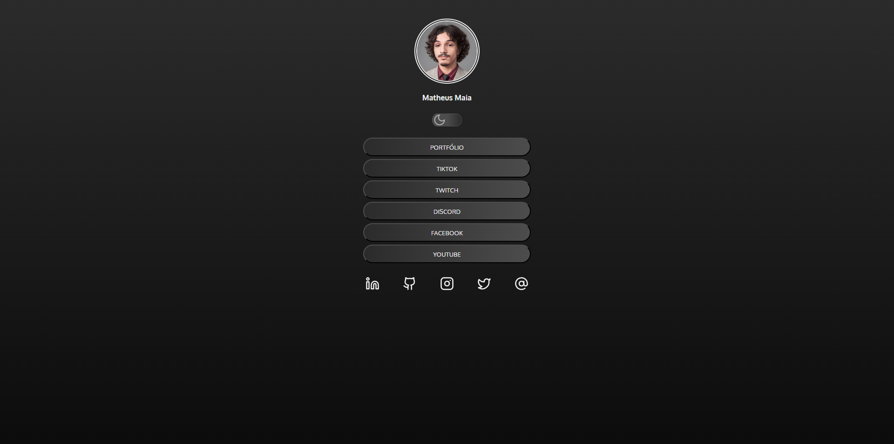

<h1 align="center"> LinkTree </h1>

Reúna todos os seus links em um único lugar!

<a href="##-tecnologias">Tecnologias</a>&nbsp;&nbsp;&nbsp;|&nbsp;&nbsp;
<a href="#-projeto">Projeto</a>

 

## Tecnologias

Esse projeto foi desenvolvido com as seguintes tecnologias:

- HTML
- CSS
- JavaScript
- Git
- Github
  
## Projeto
O projeto LinkTree é um projeto feito para reunir diversos links em um único lugar, agregando as informações e assim facilitando o acesso a qualquer tipo de mídia.